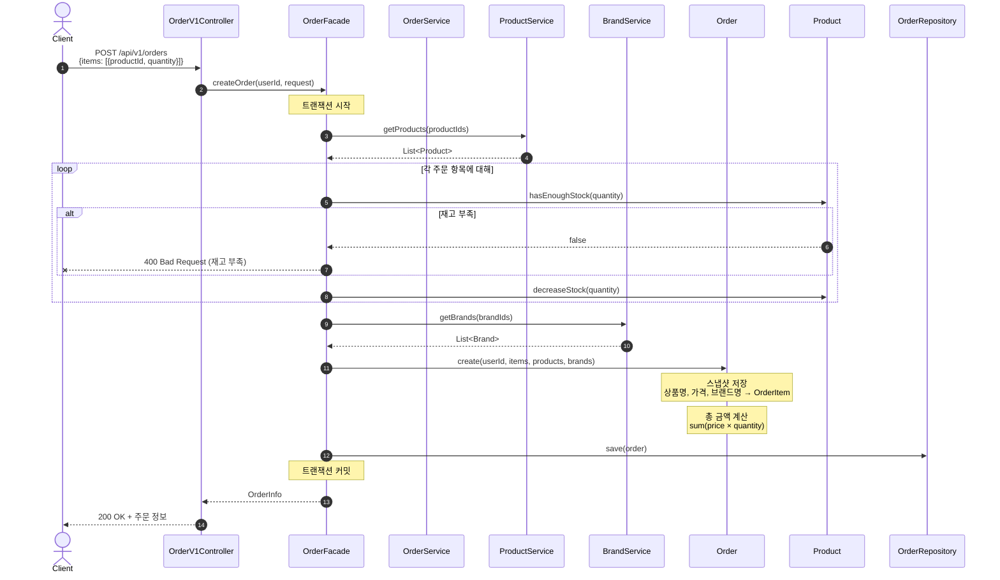
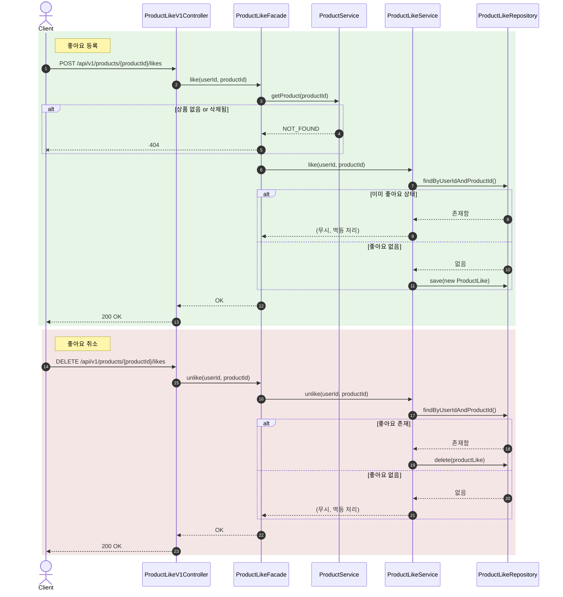
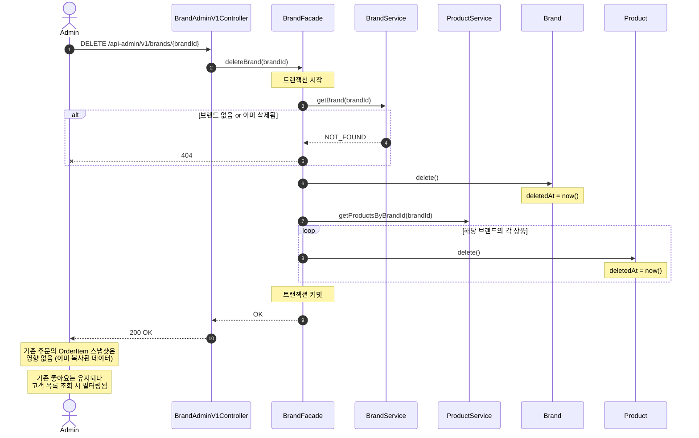

# 02. 시퀀스 다이어그램

## 1. 주문 생성 흐름

### 왜 이 다이어그램이 필요한가

주문 생성은 이 시스템에서 가장 복잡한 흐름이다.
여러 상품의 재고 확인 → 차감 → 스냅샷 저장 → 주문 생성이 **하나의 트랜잭션** 안에서 일어나야 하며,
어느 단계에서 실패하든 전체가 롤백되어야 한다.

이 다이어그램으로 검증하려는 것:
- 각 객체의 **책임 분리**가 명확한가
- **트랜잭션 경계**가 어디인지
- 실패 시 **어느 시점에서 어떤 예외**가 발생하는지

### 다이어그램

### 이 구조에서 봐야 할 포인트

1. **트랜잭션 경계는 Facade 레벨**이다. ProductService에서 상품을 조회하고, 재고 차감과 주문 저장이 하나의 트랜잭션으로 묶인다. 하나라도 실패하면 재고 차감도 롤백된다.
2. **Product 도메인 객체가 재고 차감 책임**을 갖는다. Service가 아닌 엔티티에서 `decreaseStock()`을 호출하므로, 비즈니스 규칙(재고 부족 검증)이 도메인에 응집된다.
3. **스냅샷 생성은 Order 생성 시점**에 발생한다. OrderItem이 Product의 현재 상태를 복사하므로, 이후 상품 가격이 변경되어도 주문 이력에는 영향이 없다.

---

## 2. 좋아요 등록/취소 흐름

### 왜 이 다이어그램이 필요한가

좋아요는 **멱등성**이 핵심이다.
같은 요청이 여러 번 와도 결과가 동일해야 하며, 등록과 취소의 분기가 명확해야 한다.

이 다이어그램으로 검증하려는 것:
- 멱등 처리 로직이 어느 레이어에서 판단되는가
- 존재하지 않는 상품에 대한 방어가 되는가

### 다이어그램

### 이 구조에서 봐야 할 포인트

1. **좋아요 등록 시에만 상품 존재 여부를 확인**한다. 취소 시에는 상품이 삭제되었더라도 기존 좋아요를 제거할 수 있어야 하므로 상품 검증을 생략한다.
2. **멱등 처리는 Service 레벨**에서 판단한다. 이미 좋아요가 있으면 등록을 무시하고, 없으면 삭제를 무시한다. 에러를 던지지 않는다.
3. **물리 삭제(hard delete)를 사용**한다. 좋아요는 이력 보존이 불필요하고 토글 성격이므로, soft delete 대신 실제 레코드를 삭제한다.

---

## 3. 브랜드 삭제 (어드민) 흐름

### 왜 이 다이어그램이 필요한가

브랜드 삭제는 **연쇄 삭제(cascade soft delete)** 가 발생하는 유일한 흐름이다.
브랜드 하나를 삭제하면 소속 상품 전체가 soft delete 되므로, 영향 범위가 크다.

이 다이어그램으로 검증하려는 것:
- cascade 범위가 어디까지인지
- 기존 주문/좋아요 데이터에 영향이 없는지

### 다이어그램

### 이 구조에서 봐야 할 포인트

1. **브랜드와 소속 상품이 하나의 트랜잭션**으로 처리된다. 상품 삭제 중 실패하면 브랜드 삭제도 롤백된다.
2. **주문 데이터는 안전**하다. OrderItem에 스냅샷으로 저장되어 있으므로, 원본 상품/브랜드가 삭제되어도 주문 이력은 그대로 유지된다.
3. **좋아요 레코드 자체는 삭제하지 않는다.** 대신 고객이 좋아요 목록을 조회할 때, 삭제된 상품을 필터링한다. 이렇게 하면 cascade 범위가 제한되고, 좋아요 수 통계를 나중에 복원할 여지도 남긴다.

---

## 잠재 리스크

| 리스크 | 영향 | 대안 |
|--------|------|------|
| 주문 생성 트랜잭션이 비대해질 수 있음 | 상품 수가 많으면 락 시간 증가 | 향후 비관적 락 또는 분산 락 도입 |
| 브랜드 삭제 시 상품이 수천 개면 느릴 수 있음 | 트랜잭션 시간 증가, 타임아웃 가능 | 배치 처리 또는 비동기 삭제로 전환 |
| 좋아요 COUNT 쿼리가 상품 목록 정렬에 사용됨 | `likes_desc` 정렬 시 매번 집계 필요 | 비정규화 카운터 필드 도입 |
