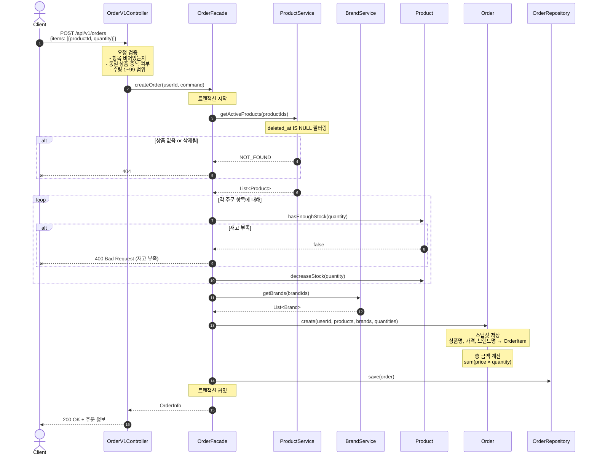
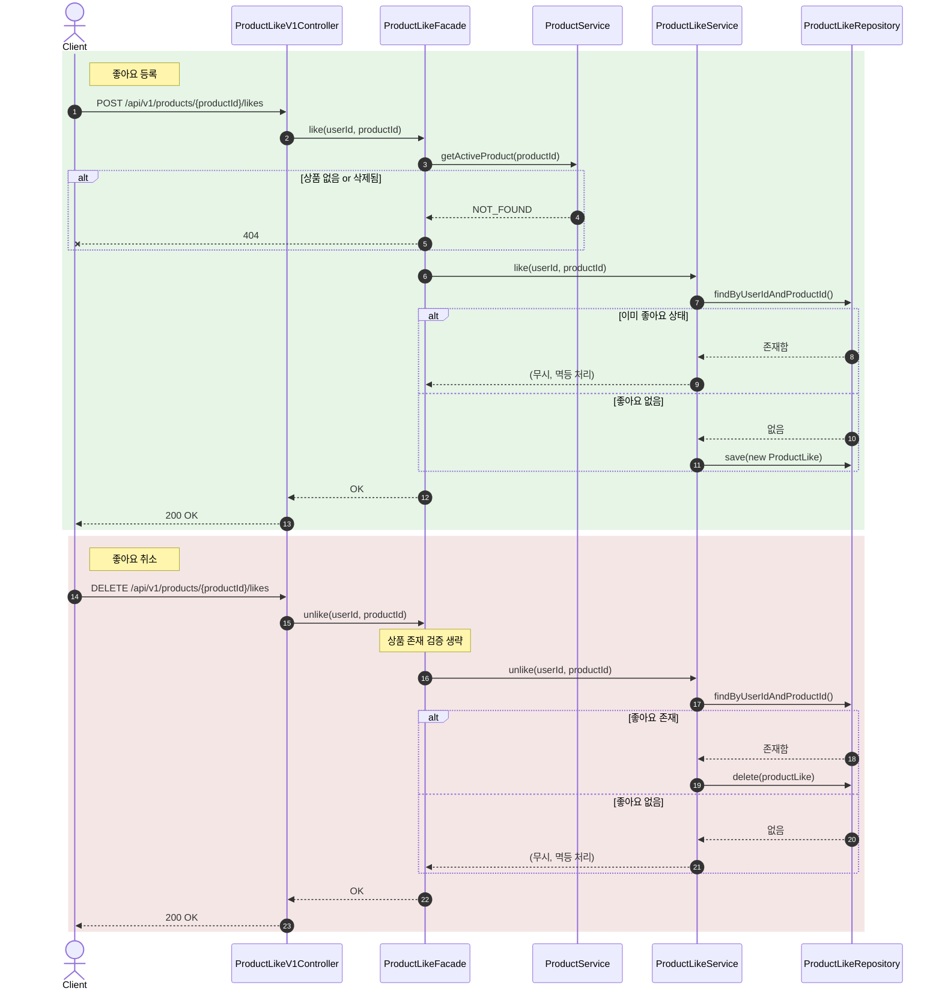
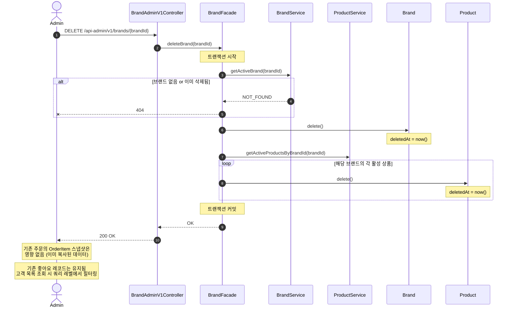

# 02. 시퀀스 다이어그램

## 1. 주문 생성 흐름

### 왜 이 다이어그램이 필요한가

주문 생성은 이 시스템에서 가장 복잡한 흐름이다.
입력 검증 → 상품 존재/삭제 확인 → 재고 확인 → 차감 → 브랜드 조회 → 스냅샷 저장 → 주문 생성이 **하나의 트랜잭션** 안에서 일어나야 하고, 어느 단계에서 실패하든 전체가 롤백되어야 한다.

특히 검증해야 할 건:
- 요청 레벨 검증(중복 상품, 수량 범위)과 도메인 레벨 검증(상품 존재, 재고)의 **순서와 책임 분리**
- 재고 차감과 주문 저장이 묶이는 **트랜잭션 경계**
- 스냅샷에 필요한 브랜드 정보를 **어디서 가져오는지**

### 다이어그램

### 이 구조에서 봐야 할 포인트

1. **검증이 두 단계로 나뉜다.** 요청 형식 검증(중복 상품, 수량 범위)은 Controller에서, 도메인 검증(상품 존재, 재고 충분)은 트랜잭션 안에서 한다. 형식이 잘못된 요청은 트랜잭션을 열기도 전에 걸러낸다.
2. **ProductService.getActiveProducts()가 삭제된 상품을 필터링**한다. 메서드 이름에 "Active"를 넣어서 soft delete 필터링이 적용된다는 걸 명시적으로 드러낸다. 요청한 productId 중 하나라도 조회되지 않으면 404.
3. **BrandService 호출이 재고 차감 이후에 있다.** 재고가 부족하면 브랜드를 조회할 필요 자체가 없으므로, 불필요한 쿼리를 아끼기 위해 이 순서로 배치했다.
4. **트랜잭션 하나에 모든 게 묶인다.** 상품이 10개, 20개여도 현재는 하나의 트랜잭션이다. 상품 수가 극단적으로 많아지면 락 시간이 길어지는 리스크가 있지만, 현재 규모에서는 정합성이 더 중요하다.

---

## 2. 좋아요 등록/취소 흐름

### 왜 이 다이어그램이 필요한가

좋아요의 핵심은 **멱등성**이다. 같은 요청이 여러 번 와도 결과가 동일해야 하며, 등록과 취소에서 상품 검증 범위가 다르다는 점이 설계 의도를 명확히 드러내야 할 부분이다.

### 다이어그램

### 이 구조에서 봐야 할 포인트

1. **등록 시에만 상품 존재 여부를 확인하고, 취소 시에는 생략한다.** 이유는 명확하다 — 상품이 삭제된 후에도 유저가 기존 좋아요를 해제할 수 있어야 한다. 삭제된 상품의 좋아요를 취소하려는데 "상품이 없습니다"라고 하면 유저 입장에서 답답하다.
2. **멱등 처리는 LikeService에서 판단한다.** 이미 좋아요가 있으면 등록을 무시하고, 없으면 삭제를 무시한다. 에러를 던지지 않으므로 클라이언트는 현재 상태를 몰라도 안전하게 요청할 수 있다.
3. **좋아요는 물리 삭제(hard delete)를 사용한다.** 좋아요 이력을 보존할 필요가 없고, 토글 성격이므로 soft delete는 과하다. `(user_id, product_id)` 유니크 제약이 있으므로 soft delete를 쓰면 재등록 시 충돌 문제도 생긴다.

---

## 3. 브랜드 삭제 (어드민) 흐름

### 왜 이 다이어그램이 필요한가

브랜드 삭제는 **cascade soft delete**가 발생하는 유일한 흐름이다. 브랜드 하나를 삭제하면 소속 상품 전체가 함께 soft delete 되므로 영향 범위가 크다. 기존 주문이나 좋아요 데이터에 영향이 없는지를 검증해야 한다.

### 다이어그램

### 이 구조에서 봐야 할 포인트

1. **브랜드와 소속 상품이 하나의 트랜잭션으로 처리된다.** 상품 삭제 도중 실패하면 브랜드 삭제도 롤백된다. 원자성이 보장된다.
2. **주문 데이터는 안전하다.** OrderItem에 상품명, 가격, 브랜드명이 스냅샷으로 복사되어 있으므로, 원본이 삭제되어도 주문 이력 조회에 문제가 없다. 이게 스냅샷을 도입한 핵심 이유다.
3. **좋아요 레코드 자체는 삭제하지 않는다.** cascade 범위를 좋아요까지 넓히면 트랜잭션이 더 비대해진다. 대신 고객이 좋아요 목록을 조회할 때 `products.deleted_at IS NULL` join으로 삭제된 상품을 걸러낸다.

---

## 잠재 리스크

| 리스크 | 영향 | 대안 |
|--------|------|------|
| 주문 생성 트랜잭션이 비대해질 수 있음 | 상품 수가 많으면 재고 차감마다 row lock, 트랜잭션 시간 증가 | 향후 비관적 락 도입 시 락 순서를 productId 순으로 고정하여 데드락 방지 |
| 브랜드 삭제 시 상품이 수천 개면 느릴 수 있음 | 트랜잭션 시간 증가, 타임아웃 가능 | 배치 처리 또는 `UPDATE products SET deleted_at = now() WHERE brand_id = ?` 벌크 쿼리로 전환 |
| 좋아요 COUNT 쿼리가 상품 목록 정렬에 사용됨 | `likes_desc` 정렬 시 매번 서브쿼리 집계 필요 | 트래픽 증가 시 Product에 `like_count` 비정규화 필드 도입 |
| 좋아요 목록에서 삭제된 상품 필터링 | join 조건으로 처리하므로 쿼리 복잡도 약간 증가 | 현재 규모에서는 문제 없음. 데이터 증가 시 인덱스 튜닝으로 대응 |
