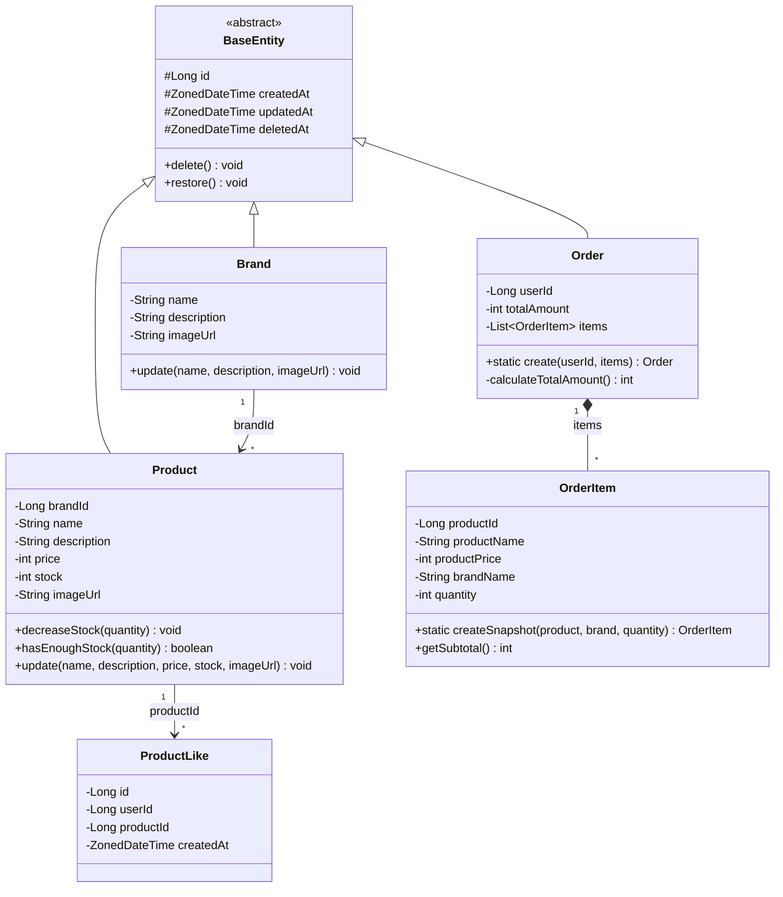

```mermaid
classDiagram
    direction TB

    namespace interfaces {
        class BrandV1Controller {
            +getBrand(brandId) ApiResponse
        }
        class BrandAdminV1Controller {
            +listBrands(page, size, deleted) ApiResponse
            +getBrand(brandId) ApiResponse
            +createBrand(request) ApiResponse
            +updateBrand(brandId, request) ApiResponse
            +deleteBrand(brandId) ApiResponse
        }
        class ProductV1Controller {
            +listProducts(brandId, sort, page, size) ApiResponse
            +getProduct(productId) ApiResponse
        }
        class ProductAdminV1Controller {
            +listProducts(page, size, brandId, deleted) ApiResponse
            +getProduct(productId) ApiResponse
            +createProduct(request) ApiResponse
            +updateProduct(productId, request) ApiResponse
            +deleteProduct(productId) ApiResponse
        }
        class ProductLikeV1Controller {
            +like(userId, productId) ApiResponse
            +unlike(userId, productId) ApiResponse
            +getMyLikes(userId) ApiResponse
        }
        class OrderV1Controller {
            +createOrder(userId, request) ApiResponse
            +listOrders(userId, startAt, endAt, page, size) ApiResponse
            +getOrder(userId, orderId) ApiResponse
        }
        class OrderAdminV1Controller {
            +listOrders(page, size) ApiResponse
            +getOrder(orderId) ApiResponse
        }
    }

    namespace application {
        class BrandFacade {
            +createBrand(command) BrandInfo
            +updateBrand(command) BrandInfo
            +deleteBrand(brandId) void
        }
        class ProductFacade {
            +createProduct(command) ProductInfo
            +updateProduct(command) ProductInfo
            +deleteProduct(productId) void
        }
        class OrderFacade {
            +createOrder(userId, command) OrderInfo
        }
        class ProductLikeFacade {
            +like(userId, productId) void
            +unlike(userId, productId) void
        }
    }

    namespace domain {
        class BrandService {
            +register(name, description, imageUrl) Brand
            +getActiveBrand(brandId) Brand
            +getBrands(brandIds) List~Brand~
        }
        class ProductService {
            +register(brandId, name, desc, price, stock, imageUrl) Product
            +getActiveProduct(productId) Product
            +getActiveProducts(productIds) List~Product~
            +getActiveProductsByBrandId(brandId) List~Product~
        }
        class ProductLikeService {
            +like(userId, productId) void
            +unlike(userId, productId) void
            +getLikedProducts(userId) List~ProductLike~
        }
        class OrderService {
            +createOrder(userId, totalAmount, items) Order
            +getOrder(orderId) Order
            +getOrdersByUserId(userId, startAt, endAt, page, size) Page~Order~
        }
    }

    %% 단순 조회: Controller → Service 직접
    BrandV1Controller --> BrandService
    ProductV1Controller --> ProductService
    OrderAdminV1Controller --> OrderService

    %% 도메인 조합이 필요한 경우: Controller → Facade
    BrandAdminV1Controller --> BrandFacade
    ProductAdminV1Controller --> ProductFacade
    ProductLikeV1Controller --> ProductLikeFacade
    OrderV1Controller --> OrderFacade

    %% Facade → Service 의존
    BrandFacade --> BrandService
    BrandFacade --> ProductService
    ProductFacade --> ProductService
    ProductFacade --> BrandService
    OrderFacade --> ProductService
    OrderFacade --> OrderService
    OrderFacade --> BrandService
    ProductLikeFacade --> ProductService
    ProductLikeFacade --> ProductLikeService
```

# 03. 클래스 다이어그램

## 1. JPA 엔티티 모델

### 왜 이 다이어그램이 필요한가

DB에 영속화되는 JPA 엔티티들의 **필드, 행위, 관계**를 보여준다.
ERD가 "테이블에 뭐가 들어가는가"라면, 이 다이어그램은 "객체가 어떤 비즈니스 규칙을 캡슐화하는가"를 검증한다.

특히 봐야 할 건:
- 어떤 엔티티가 BaseEntity를 상속하고, 어떤 엔티티가 상속하지 않는지 — 그 이유
- 엔티티 간 관계가 JPA 연관관계인지, ID 참조인지
- 비즈니스 로직이 Service가 아닌 엔티티에 있는 경우 그 근거

### 다이어그램

### 이 구조에서 봐야 할 포인트

1. **BaseEntity를 상속하는 엔티티(Brand, Product, Order)와 상속하지 않는 엔티티(ProductLike, OrderItem)가 나뉜다.**
   - ProductLike는 물리 삭제(hard delete)를 사용한다. soft delete를 쓰면 `(user_id, product_id)` 유니크 제약과 충돌하고, updatedAt도 필요 없다. 그래서 BaseEntity를 상속하지 않고 자체적으로 id, createdAt만 관리한다.
   - OrderItem은 Order에 종속된 Composition 관계다. Order가 생성될 때 함께 생성되고, 독립적으로 삭제/수정되지 않는다.

2. **Product와 Brand는 ID 참조 관계다.** `brandId` 필드(Long 타입)로 연결하며, JPA `@ManyToOne`은 사용하지 않는다. 도메인 간 결합도를 낮추기 위해서다. 단, DB 레벨에서는 FK 제약을 걸어 참조 무결성은 보장한다. "JPA 연관관계 없음 ≠ DB FK 없음"이라는 점이 중요하다.

3. **재고 관련 로직은 Product 엔티티에 있다.** `decreaseStock()`은 재고 부족 시 예외를 던지고, `hasEnoughStock()`은 충분 여부를 반환한다. 이 로직을 Service에 두면 "재고 검증 없이 차감"하는 실수가 가능해진다. 엔티티 자체가 자기 불변 조건을 지키게 하는 게 안전하다.

---

## 2. 서비스 / 애플리케이션 레이어

### 왜 이 다이어그램이 필요한가

엔티티가 "무엇을 저장하고, 어떤 규칙을 갖는가"를 정의한다면, Service/Facade는 "누가 엔티티를 조회/조합하고, 트랜잭션을 어떻게 관리하는가"를 정의한다. 이 두 관심사가 섞이면 코드가 금방 복잡해진다.

특히 봐야 할 건:
- 어떤 Controller가 Service를 직접 호출하고, 어떤 Controller가 Facade를 경유하는지
- Facade가 존재하는 이유 (여러 도메인 조합이 필요한 경우)
- Service 간 직접 의존이 없는지

### 다이어그램

### 이 구조에서 봐야 할 포인트

1. **단순 조회는 Controller → Service 직접 호출한다.** Facade를 거칠 이유가 없는 경우에 불필요한 레이어를 추가하지 않는다.
   - `BrandV1Controller → BrandService`: 고객 브랜드 조회
   - `ProductV1Controller → ProductService`: 고객 상품 목록/상세 조회
   - `OrderAdminV1Controller → OrderService`: 어드민 주문 조회

2. **여러 도메인을 조합해야 하면 반드시 Facade를 경유한다.** Facade가 트랜잭션 경계이자 도메인 간 조율자 역할을 한다.
   - `OrderFacade`: ProductService(상품 조회 + 재고 차감) + BrandService(브랜드명 조회) + OrderService(주문 저장)
   - `BrandFacade`: BrandService(브랜드 삭제) + ProductService(소속 상품 일괄 삭제)
   - `ProductFacade`: ProductService(상품 등록/수정) + BrandService(브랜드 존재 여부 검증)
   - `ProductLikeFacade`: ProductService(상품 존재 확인) + ProductLikeService(좋아요 처리)

3. **Service 간에는 직접 의존하지 않는다.** 처음에 ProductService에서 BrandService를 직접 호출하는 방식도 고민했는데, 그러면 Service 간 순환 의존이나 책임 경계 모호함이 생긴다. 여러 Service를 조합해야 하면 항상 Facade에서 한다.

4. **Service 메서드 이름에 soft delete 필터링 여부를 드러낸다.** `getActiveProduct()`는 삭제된 상품을 제외하고 조회한다. `getProduct()`처럼 모호한 이름 대신, 의도를 명시해서 필터링 누락 실수를 방지한다.

---

## 3. 엔티티 상세 설계

### Brand

| 필드 | 타입 | 제약 | 설명 |
|------|------|------|------|
| name | String | not null, max 100 | 브랜드명. DB UNIQUE 없음, Application 레벨에서 활성 브랜드 중 중복 검증. |
| description | String | nullable, max 500 | 브랜드 설명 |
| imageUrl | String | nullable, max 500 | 브랜드 이미지 URL |

### Product

| 필드 | 타입 | 제약 | 설명 |
|------|------|------|------|
| brandId | Long | not null | 소속 브랜드 ID. JPA 연관관계 없음, DB FK 있음. |
| name | String | not null, max 200 | 상품명 |
| description | String | nullable, max 1000 | 상품 설명 |
| price | int | not null, >= 0 | 판매 가격 |
| stock | int | not null, >= 0 | 재고 수량 |
| imageUrl | String | nullable, max 500 | 상품 이미지 URL |

**도메인 메서드:**
- `decreaseStock(int quantity)`: 재고 차감. `stock < quantity`이면 `CoreException(BAD_REQUEST)` 발생.
- `hasEnoughStock(int quantity)`: 재고 충분 여부 boolean 반환.
- `update(...)`: brandId를 제외한 필드 수정. 브랜드 변경 불가 정책을 엔티티 레벨에서 강제.

### ProductLike

| 필드 | 타입 | 제약 | 설명 |
|------|------|------|------|
| id | Long | PK, auto increment | - |
| userId | Long | not null | 좋아요한 유저 ID |
| productId | Long | not null | 좋아요 대상 상품 ID |
| createdAt | ZonedDateTime | not null | 좋아요 시점 |

**BaseEntity를 상속하지 않는다.** soft delete 불필요(물리 삭제), updatedAt 불필요. 자체 id/createdAt만 관리.
**제약:** `(userId, productId)` 유니크 제약. 멱등성의 DB 레벨 안전장치.

### Order

| 필드 | 타입 | 제약 | 설명 |
|------|------|------|------|
| userId | Long | not null | 주문자 ID |
| totalAmount | int | not null, >= 0 | 총 주문 금액 |

**도메인 메서드:**
- `static create(userId, List<OrderItem>)`: 팩토리 메서드. OrderItem 목록을 받아 총 금액을 자동 계산한다.

### OrderItem

| 필드 | 타입 | 제약 | 설명 |
|------|------|------|------|
| productId | Long | not null | 원본 상품 ID (참조용, FK 아님) |
| productName | String | not null | 스냅샷: 주문 시점 상품명 |
| productPrice | int | not null | 스냅샷: 주문 시점 단가 |
| brandName | String | not null | 스냅샷: 주문 시점 브랜드명 |
| quantity | int | not null, 1~99 | 주문 수량 |

**도메인 메서드:**
- `static createSnapshot(product, brand, quantity)`: Product와 Brand에서 필요한 정보만 복사하여 스냅샷을 생성한다.
- `getSubtotal()`: `productPrice * quantity` 반환.

**Order와 Composition 관계.** `@OneToMany`로 관리되며 독립 생명주기 없음.
**productId에 FK를 걸지 않는 이유:** 원본 상품이 삭제(soft delete)되어도 주문 항목은 보존되어야 한다. FK가 있으면 참조 대상이 "삭제됨"인 상태에서 정합성 문제가 복잡해진다. 조회 시에는 스냅샷 데이터만 사용하므로 원본을 참조할 일이 없다.

---

## 잠재 리스크

| 리스크 | 설명 | 선택지 |
|--------|------|--------|
| Product-Brand ID 참조 시 정합성 | JPA 연관관계 없이 brandId만 저장하면 코드 레벨에서 존재하지 않는 브랜드 참조 가능 | DB FK 제약으로 기본 보장 + ProductFacade에서 Application 레벨 추가 검증 |
| OrderItem 증가에 따른 Order 조회 성능 | 주문 항목이 많아지면 Order 조회 시 N+1 가능 | fetch join 또는 별도 조회 쿼리 |
| 좋아요 수 실시간 집계 | `likes_desc` 정렬마다 COUNT 서브쿼리 발생 | 현재는 COUNT로 충분. 트래픽 증가 시 Product에 `likeCount` 비정규화 필드 추가 |
| getActiveXxx() 네이밍 규칙 강제 어려움 | 실수로 deleted 포함 조회 메서드를 호출할 가능성 | Repository 레벨에서 기본 조회 시 deleted_at IS NULL 조건 강제 (Custom Repository 또는 `@Where`) |
