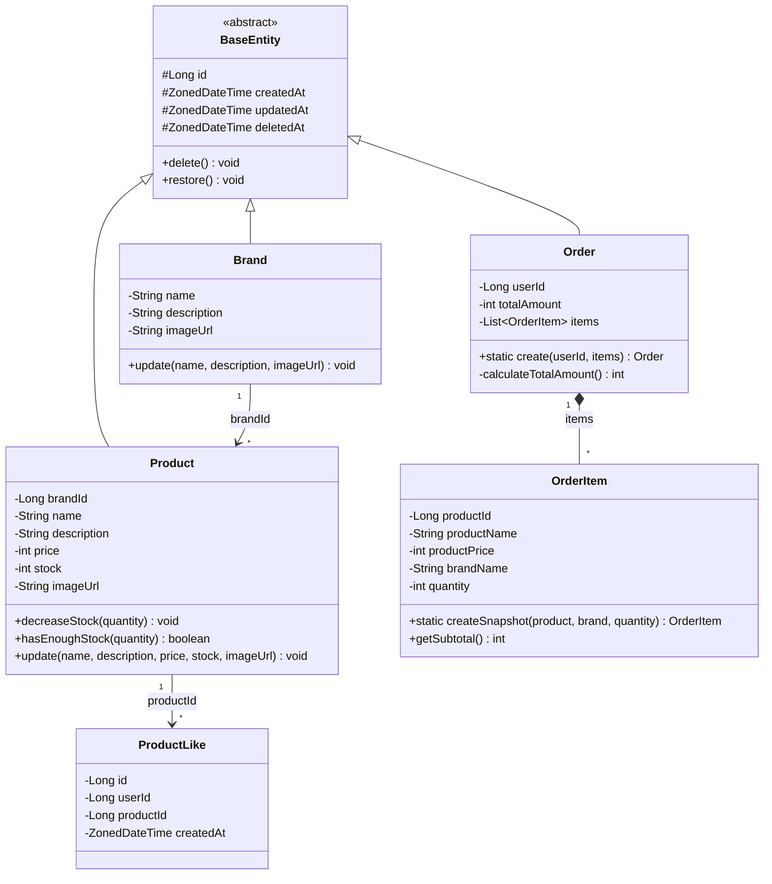

```mermaid
classDiagram
    direction TB

    namespace interfaces {
        class BrandV1Controller {
            +getBrand(brandId) ApiResponse
        }
        class BrandAdminV1Controller {
            +listBrands(page, size) ApiResponse
            +getBrand(brandId) ApiResponse
            +createBrand(request) ApiResponse
            +updateBrand(brandId, request) ApiResponse
            +deleteBrand(brandId) ApiResponse
        }
        class ProductV1Controller {
            +listProducts(brandId, sort, page, size) ApiResponse
            +getProduct(productId) ApiResponse
        }
        class ProductAdminV1Controller {
            +listProducts(page, size, brandId) ApiResponse
            +getProduct(productId) ApiResponse
            +createProduct(request) ApiResponse
            +updateProduct(productId, request) ApiResponse
            +deleteProduct(productId) ApiResponse
        }
        class ProductLikeV1Controller {
            +like(userId, productId) ApiResponse
            +unlike(userId, productId) ApiResponse
            +getMyLikes(userId) ApiResponse
        }
        class OrderV1Controller {
            +createOrder(userId, request) ApiResponse
            +listOrders(userId, startAt, endAt, page, size) ApiResponse
            +getOrder(userId, orderId) ApiResponse
        }
        class OrderAdminV1Controller {
            +listOrders(page, size) ApiResponse
            +getOrder(orderId) ApiResponse
        }
    }

    namespace application {
        class BrandFacade {
            +createBrand(command) BrandInfo
            +updateBrand(command) BrandInfo
            +deleteBrand(brandId) void
        }
        class ProductFacade {
            +createProduct(command) ProductInfo
            +updateProduct(command) ProductInfo
            +deleteProduct(productId) void
        }
        class OrderFacade {
            +createOrder(userId, command) OrderInfo
        }
        class ProductLikeFacade {
            +like(userId, productId) void
            +unlike(userId, productId) void
        }
    }

    namespace domain {
        class BrandService {
            +register(name, description, imageUrl) Brand
            +getBrand(brandId) Brand
        }
        class ProductService {
            +register(brandId, name, desc, price, stock, imageUrl) Product
            +getProduct(productId) Product
            +getProducts(productIds) List~Product~
            +getProductsByBrandId(brandId) List~Product~
        }
        class ProductLikeService {
            +like(userId, productId) void
            +unlike(userId, productId) void
            +getLikedProducts(userId) List~ProductLike~
        }
        class OrderService {
            +createOrder(userId, totalAmount, items) Order
            +getOrder(orderId) Order
            +getOrdersByUserId(userId, startAt, endAt, page, size) Page~Order~
        }
    }

    %% 단순 조회: Controller → Service 직접
    BrandV1Controller --> BrandService
    ProductV1Controller --> ProductService
    OrderAdminV1Controller --> OrderService

    %% 도메인 조합이 필요한 경우: Controller → Facade
    BrandAdminV1Controller --> BrandFacade
    ProductAdminV1Controller --> ProductFacade
    ProductLikeV1Controller --> ProductLikeFacade
    OrderV1Controller --> OrderFacade

    %% Facade → Service 의존
    BrandFacade --> BrandService
    BrandFacade --> ProductService
    ProductFacade --> ProductService
    ProductFacade --> BrandService
    OrderFacade --> ProductService
    OrderFacade --> OrderService
    OrderFacade --> BrandService
    ProductLikeFacade --> ProductService
    ProductLikeFacade --> ProductLikeService
```

# 03. 클래스 다이어그램

## 1. JPA 엔티티 모델

### 왜 이 다이어그램이 필요한가

DB에 영속화되는 JPA 엔티티들의 **필드, 행위, 관계**를 보여준다.
ERD(테이블 구조)와 대응되는 객체 모델이며, 각 엔티티가 어떤 비즈니스 규칙을 캡슐화하는지를 검증한다.

### 다이어그램

### 이 구조에서 봐야 할 포인트

1. **BaseEntity를 상속하는 엔티티 (Brand, Product, Order)** 는 soft delete, 생성/수정 시각을 자동으로 갖는다.
2. **BaseEntity를 상속하지 않는 엔티티 (ProductLike, OrderItem)** 는 각각의 이유가 있다.
   - ProductLike: 물리 삭제(hard delete) 사용, updatedAt 불필요. 자체 id, createdAt만 관리.
   - OrderItem: Order에 종속된 Composition 관계. Order와 생명주기를 같이 한다.
3. **Product와 Brand는 ID 참조** 관계다. `brandId` 필드로 연결하며, JPA `@ManyToOne` 연관관계는 사용하지 않는다.
4. **재고 차감 로직(`decreaseStock`, `hasEnoughStock`)은 Product 엔티티에 있다.** 비즈니스 규칙이 도메인 객체에 응집된다.

---

## 2. 서비스 / 애플리케이션 레이어

### 왜 이 다이어그램이 필요한가

엔티티는 "무엇을 저장하고, 어떤 규칙을 갖는가"를 정의한다.
반면 Service/Facade는 "누가 엔티티를 조회/조합하고, 트랜잭션을 어떻게 관리하는가"를 정의한다.
이 다이어그램은 **레이어 간 의존 방향과 각 클래스의 역할**을 검증한다.

### 다이어그램

### 이 구조에서 봐야 할 포인트

1. **단순 조회는 Controller → Service 직접 호출**한다.
   - `BrandV1Controller → BrandService`: 고객 브랜드 조회
   - `ProductV1Controller → ProductService`: 고객 상품 목록/상세 조회
   - `OrderAdminV1Controller → OrderService`: 어드민 주문 조회
2. **도메인 간 조합이 필요하면 Facade를 경유**한다.
   - `OrderFacade`: ProductService(재고 확인/차감) + BrandService(브랜드명 조회, 스냅샷용) + OrderService(주문 저장)
   - `BrandFacade`: BrandService(브랜드 삭제) + ProductService(소속 상품 일괄 삭제)
   - `ProductFacade`: ProductService(상품 등록/수정) + BrandService(브랜드 존재 여부 검증)
   - `ProductLikeFacade`: ProductService(상품 존재 확인) + ProductLikeService(좋아요 처리)
3. **의존 방향은 항상 상위 → 하위**다. Controller → Facade → Service → Repository. 역방향 의존은 없다.
4. **Service 간에는 직접 의존하지 않는다.** 여러 Service를 조합해야 하면 반드시 Facade에서 한다.

---

## 3. 엔티티 상세 설계

### Brand

| 필드 | 타입 | 제약 | 설명 |
|------|------|------|------|
| name | String | not null, max 100 | 브랜드명 (활성 브랜드 중 유니크) |
| description | String | nullable, max 500 | 브랜드 설명 |
| imageUrl | String | nullable, max 500 | 브랜드 이미지 URL |

### Product

| 필드 | 타입 | 제약 | 설명 |
|------|------|------|------|
| brandId | Long | not null | 소속 브랜드 ID |
| name | String | not null, max 200 | 상품명 |
| description | String | nullable, max 1000 | 상품 설명 |
| price | int | not null, >= 0 | 판매 가격 |
| stock | int | not null, >= 0 | 재고 수량 |
| imageUrl | String | nullable, max 500 | 상품 이미지 URL |

**도메인 메서드:**
- `decreaseStock(int quantity)`: 재고 차감. 재고 부족 시 `CoreException(BAD_REQUEST)` 발생.
- `hasEnoughStock(int quantity)`: 재고 충분 여부 반환.
- `update(...)`: 브랜드 ID를 제외한 필드 수정.

### ProductLike

| 필드 | 타입 | 제약 | 설명 |
|------|------|------|------|
| id | Long | PK, auto increment | - |
| userId | Long | not null | 좋아요한 유저 ID |
| productId | Long | not null | 좋아요 대상 상품 ID |
| createdAt | ZonedDateTime | not null | 좋아요 시점 |

**제약:** `(userId, productId)` 유니크 제약으로 중복 방지
**참고:** BaseEntity를 상속하지 않음. soft delete 불필요, 물리 삭제 사용.

### Order

| 필드 | 타입 | 제약 | 설명 |
|------|------|------|------|
| userId | Long | not null | 주문자 ID |
| totalAmount | int | not null, >= 0 | 총 주문 금액 |

**도메인 메서드:**
- `static create(userId, List<OrderItem>)`: 주문 생성 팩토리. 총 금액을 자동 계산.

### OrderItem

| 필드 | 타입 | 제약 | 설명 |
|------|------|------|------|
| productId | Long | not null | 원본 상품 ID (참조용) |
| productName | String | not null | 스냅샷: 상품명 |
| productPrice | int | not null | 스냅샷: 단가 |
| brandName | String | not null | 스냅샷: 브랜드명 |
| quantity | int | not null, >= 1 | 주문 수량 |

**도메인 메서드:**
- `static createSnapshot(product, brand, quantity)`: 상품/브랜드 정보를 스냅샷으로 복사하여 OrderItem 생성.
- `getSubtotal()`: `productPrice * quantity` 반환.

**참고:** Order와 Composition 관계. Order의 `@OneToMany`로 관리되며 독립 생명주기 없음.

---

## 잠재 리스크

| 리스크 | 설명 | 선택지 |
|--------|------|--------|
| Product-Brand ID 참조 시 정합성 | JPA 연관관계 없이 brandId만 저장하면 존재하지 않는 브랜드 참조 가능 | A) DB FK 제약으로 보장 B) Application 레벨에서 검증 (ProductFacade) |
| OrderItem 증가에 따른 Order 조회 성능 | 주문 항목이 많아지면 Order 조회 시 N+1 가능 | A) fetch join B) 별도 조회 쿼리 |
| 좋아요 수 실시간 집계 | `likes_desc` 정렬마다 COUNT 쿼리 발생 | A) 현재는 COUNT로 충분 B) 향후 Product에 likeCount 비정규화 필드 추가 |
