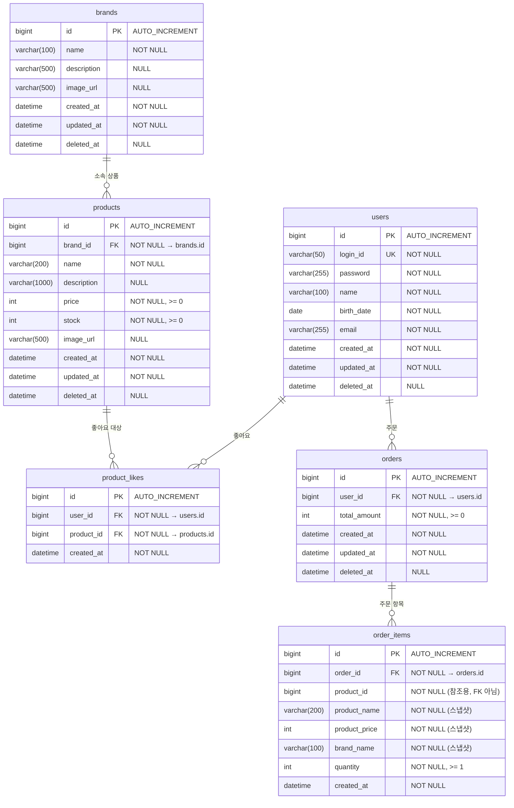

# 04. ERD (Entity-Relationship Diagram)

## 1. 전체 ERD

### 왜 이 다이어그램이 필요한가

클래스 다이어그램에서 "객체가 어떤 규칙을 갖는가"를 정의했다면, ERD는 "실제 DB에 어떤 테이블이 생기고, 어떤 컬럼과 제약이 걸리는가"를 정의한다.

이 두 개가 따로 있는 이유가 있다. JPA 엔티티 모델과 DB 스키마가 1:1로 매칭되지 않는 부분이 있기 때문이다. 예를 들어 클래스 다이어그램에서 Product는 `brandId`를 Long으로 들고 있지만, DB에서는 `brand_id`에 FK 제약이 걸린다. "JPA 연관관계 없음 ≠ DB FK 없음"이라는 원칙이 ERD에서 비로소 구체화된다.

특히 봐야 할 건:
- FK가 걸리는 곳과 걸리지 않는 곳의 차이 — 그 이유
- 스냅샷 데이터가 원본 테이블과 완전히 분리되어 있는지
- soft delete 컬럼(`deleted_at`)이 있는 테이블과 없는 테이블의 구분

### 다이어그램



### 이 구조에서 봐야 할 포인트

1. **order_items.product_id에는 FK를 걸지 않았다.** 처음에는 FK를 거는 게 정합성에 좋을 것 같았는데, 문제가 있다. 원본 상품이 soft delete 되면 `deleted_at`에 값이 들어가는 거지 row가 사라지는 건 아니니까 FK 자체는 깨지지 않는다. 하지만 나중에 물리 삭제 정책으로 바뀌거나, hard delete로 데이터를 정리해야 하는 상황이 오면 FK가 걸린 order_items 때문에 삭제가 막힌다. 애초에 주문 항목에서 원본 상품을 참조할 일이 없다 — 스냅샷 데이터(product_name, product_price, brand_name)만 쓰니까. 그래서 FK 없이 product_id를 참조용으로만 저장한다.

2. **brands.name에 UNIQUE 제약이 없다.** 처음에 당연히 UNIQUE를 걸어야 한다고 생각했는데, soft delete와 충돌이 생긴다. "Nike"를 soft delete한 뒤 새로운 "Nike"를 등록하면 DB 레벨에서 UNIQUE 위반이 난다. `UNIQUE(name, deleted_at)` 복합 유니크도 고민했지만 MySQL에서 NULL이 포함된 유니크 인덱스 동작이 직관적이지 않다. 결국 DB UNIQUE는 포기하고, **Application 레벨에서 활성 브랜드(`deleted_at IS NULL`) 중 동일 이름을 검사**하는 방식으로 갔다. 대신 `idx_brands_name` 일반 인덱스는 걸어서 이름 검색 성능은 확보했다.

3. **soft delete가 있는 테이블과 없는 테이블이 나뉜다.** `deleted_at` 컬럼이 있는 건 brands, products, orders — 이력 보존이 필요한 엔티티들이다. product_likes에는 없다. 좋아요는 토글 성격이라 이력을 남길 이유가 없고, 물리 삭제(hard delete)를 쓴다. order_items에도 없다. Order에 종속된 Composition이라 독립적으로 삭제될 일이 없다.

4. **product_likes에 `(user_id, product_id)` 유니크 제약이 걸린다.** 같은 유저가 같은 상품에 두 번 좋아요를 남기면 안 되므로, Application에서 체크하는 것과 별개로 DB 레벨 안전장치를 둔다. 멱등 처리를 Application에서만 하면, 동시 요청이 들어왔을 때 둘 다 "없음"으로 판단하고 둘 다 INSERT하는 race condition이 가능하다. UNIQUE 제약이 이걸 막아준다.

---

## 2. 인덱스 설계

인덱스는 "어떤 쿼리가 자주 실행될 것인가"를 기준으로 설계했다. API 스펙에서 역산하면 어떤 WHERE/ORDER BY 조건이 나오는지 알 수 있다.

| 테이블 | 인덱스 | 컬럼 | 왜 필요한가 |
|--------|--------|------|-------------|
| `brands` | `idx_brands_name` | `name` | 브랜드 등록 시 이름 중복 검사. UNIQUE 대신 일반 인덱스 — soft delete 때문. |
| `products` | `idx_products_brand_id` | `brand_id` | 브랜드별 상품 목록 필터링 (`?brandId=...`). FK에 자동 인덱스가 생기는 경우도 있지만 명시적으로 건다. |
| `products` | `idx_products_created_at` | `created_at DESC` | `sort=latest` 정렬. 최신순이 기본 정렬이라 가장 빈번하게 사용된다. |
| `products` | `idx_products_price` | `price ASC` | `sort=price_asc` 정렬. |
| `product_likes` | `uk_product_likes_user_product` | `user_id, product_id` (UNIQUE) | 중복 좋아요 방지 + `findByUserIdAndProductId()` 조회 성능. 유니크 제약이 곧 인덱스 역할. |
| `product_likes` | `idx_product_likes_product_id` | `product_id` | 상품별 좋아요 수 집계. `sort=likes_desc` 정렬 시 COUNT 서브쿼리에서 사용. |
| `product_likes` | `idx_product_likes_user_id` | `user_id` | 유저별 좋아요 목록 조회 (`/api/v1/users/{userId}/likes`). |
| `orders` | `idx_orders_user_id_created_at` | `user_id, created_at` | 유저별 기간 주문 조회. `user_id`로 필터링 후 `created_at` 범위 조건. 복합 인덱스 순서가 중요하다 — 등호 조건(`user_id =`)이 앞, 범위 조건(`created_at BETWEEN`)이 뒤에 와야 인덱스를 제대로 탄다. |
| `order_items` | `idx_order_items_order_id` | `order_id` | 주문 상세 조회 시 해당 주문의 항목들을 가져온다. FK에 의한 자동 인덱스가 생길 수 있지만 명시. |

`sort=likes_desc` 정렬은 현재 COUNT 서브쿼리로 처리한다. `idx_product_likes_product_id` 인덱스가 있으면 product_id 기준 COUNT가 인덱스 스캔으로 가능하지만, 결국 모든 상품에 대해 COUNT를 해야 하므로 데이터가 많아지면 느려질 수 있다. 트래픽이 증가하면 Product에 `like_count` 비정규화 컬럼을 추가하는 게 맞다.

---

## 3. 테이블별 DDL

### brands

```sql
CREATE TABLE brands (
    id          BIGINT AUTO_INCREMENT PRIMARY KEY,
    name        VARCHAR(100)  NOT NULL,
    description VARCHAR(500),
    image_url   VARCHAR(500),
    created_at  DATETIME(6)   NOT NULL,
    updated_at  DATETIME(6)   NOT NULL,
    deleted_at  DATETIME(6),
    INDEX idx_brands_name (name)
);
```

`name`에 UNIQUE가 아닌 일반 INDEX를 건 이유는 위에서 설명했다. soft delete 환경에서 DB UNIQUE는 재등록 시 충돌이 생긴다.

### products

```sql
CREATE TABLE products (
    id          BIGINT AUTO_INCREMENT PRIMARY KEY,
    brand_id    BIGINT        NOT NULL,
    name        VARCHAR(200)  NOT NULL,
    description VARCHAR(1000),
    price       INT           NOT NULL,
    stock       INT           NOT NULL,
    image_url   VARCHAR(500),
    created_at  DATETIME(6)   NOT NULL,
    updated_at  DATETIME(6)   NOT NULL,
    deleted_at  DATETIME(6),
    CONSTRAINT fk_products_brand_id FOREIGN KEY (brand_id) REFERENCES brands (id),
    INDEX idx_products_brand_id (brand_id),
    INDEX idx_products_created_at (created_at DESC)
);
```

`brand_id`에 FK를 건다. JPA에서 `@ManyToOne`을 안 쓴다고 DB FK도 안 거는 건 아니다. JPA 연관관계는 객체 그래프 탐색 편의를 위한 것이고, DB FK는 참조 무결성을 위한 것이다. 존재하지 않는 brand_id가 들어오는 걸 DB 레벨에서 막아야 한다.

`price`와 `stock`에 `CHECK (price >= 0)`, `CHECK (stock >= 0)` 제약을 걸 수도 있었는데, 현재는 Application 레벨 검증으로 처리한다. 향후 동시성 이슈가 실제로 발생하면 DB CHECK 제약을 추가하는 게 이중 안전장치가 된다.

### product_likes

```sql
CREATE TABLE product_likes (
    id          BIGINT AUTO_INCREMENT PRIMARY KEY,
    user_id     BIGINT      NOT NULL,
    product_id  BIGINT      NOT NULL,
    created_at  DATETIME(6) NOT NULL,
    CONSTRAINT fk_product_likes_user_id FOREIGN KEY (user_id) REFERENCES users (id),
    CONSTRAINT fk_product_likes_product_id FOREIGN KEY (product_id) REFERENCES products (id),
    UNIQUE KEY uk_product_likes_user_product (user_id, product_id),
    INDEX idx_product_likes_product_id (product_id),
    INDEX idx_product_likes_user_id (user_id)
);
```

`updated_at`과 `deleted_at`이 없다. 좋아요는 있거나 없거나 둘 중 하나다. 수정할 일이 없으니 `updated_at`이 필요 없고, 물리 삭제를 쓰니 `deleted_at`도 필요 없다.

`user_id`와 `product_id` 각각에 단독 인덱스를 건 이유: 유니크 인덱스 `(user_id, product_id)`는 `user_id`가 선행 컬럼이라 `user_id` 단독 조회에는 활용 가능하다. 하지만 `product_id` 단독 조회(좋아요 수 집계)에는 이 유니크 인덱스를 쓸 수 없다. 그래서 `idx_product_likes_product_id`를 별도로 건다.

### orders

```sql
CREATE TABLE orders (
    id           BIGINT AUTO_INCREMENT PRIMARY KEY,
    user_id      BIGINT      NOT NULL,
    total_amount INT         NOT NULL,
    created_at   DATETIME(6) NOT NULL,
    updated_at   DATETIME(6) NOT NULL,
    deleted_at   DATETIME(6),
    CONSTRAINT fk_orders_user_id FOREIGN KEY (user_id) REFERENCES users (id),
    INDEX idx_orders_user_id_created_at (user_id, created_at)
);
```

`status` 컬럼이 없다. 현재는 선결 조건(상품 존재, 재고 충분) 통과 = 주문 완료이므로, 상태를 추적할 필요가 없다. 결제가 도입되면 `ALTER TABLE ADD COLUMN status` 마이그레이션이 필요하겠지만, 지금 쓰지 않는 필드를 미리 넣는 건 과설계다.

### order_items

```sql
CREATE TABLE order_items (
    id            BIGINT AUTO_INCREMENT PRIMARY KEY,
    order_id      BIGINT       NOT NULL,
    product_id    BIGINT       NOT NULL,
    product_name  VARCHAR(200) NOT NULL,
    product_price INT          NOT NULL,
    brand_name    VARCHAR(100) NOT NULL,
    quantity      INT          NOT NULL,
    created_at    DATETIME(6)  NOT NULL,
    CONSTRAINT fk_order_items_order_id FOREIGN KEY (order_id) REFERENCES orders (id),
    INDEX idx_order_items_order_id (order_id)
);
```

`product_id`에 FK를 걸지 않는다. 스냅샷 철학과 일관된 결정이다. 이 테이블의 `product_name`, `product_price`, `brand_name`은 주문 시점에 복사된 데이터이고, 원본이 바뀌거나 삭제되어도 여기 저장된 값은 독립적이다. `product_id`는 "어떤 상품이었는지" 참조할 수 있게 남겨두는 것이지, 원본 데이터를 다시 조회하겠다는 뜻이 아니다.

`updated_at`과 `deleted_at`이 없다. Order에 종속된 Composition 관계여서 독립적으로 수정/삭제되지 않는다.

---

## 4. 데이터 정합성 전략

각 항목에 대해 "왜 이 전략을 선택했는가"를 함께 정리한다.

| 항목 | 전략 | 왜 이렇게 했는가 |
|------|------|-------------------|
| 좋아요 중복 방지 | `(user_id, product_id)` UNIQUE 제약 | Application 멱등 처리만으로는 동시 요청 시 race condition 가능. DB 레벨 UNIQUE가 최종 안전장치. |
| 재고 음수 방지 | Application 레벨 검증 | `Product.decreaseStock()`에서 재고 부족 시 예외 발생. 현재는 이걸로 충분하지만, 동시 주문이 실제로 문제가 되면 비관적 락 또는 DB `CHECK (stock >= 0)` 추가. |
| 주문-상품 정합성 | 스냅샷 분리 | order_items에 상품 정보를 복사. 원본이 변경/삭제되어도 주문 이력에 영향 없음. FK 없이 product_id만 참조용 저장. |
| 브랜드명 중복 방지 | Application 레벨 검증 | 활성 브랜드(`deleted_at IS NULL`) 중 동일 이름 검사. DB UNIQUE는 soft delete와 충돌하므로 사용 안 함. |
| 브랜드-상품 종속성 | Application Cascade Soft Delete | 브랜드 삭제 시 소속 상품 일괄 soft delete. DB CASCADE DELETE는 물리 삭제이므로 적합하지 않음. |
| Soft Delete 필터링 | `WHERE deleted_at IS NULL` | 고객 API 조회 시 반드시 이 조건을 포함. Service 메서드를 `getActiveXxx()`로 네이밍하여 필터링 적용을 명시적으로 드러낸다. |

---

## 잠재 리스크

| 리스크 | 왜 문제가 되는가 | 현재 대응 / 향후 선택지 |
|--------|------------------|------------------------|
| soft delete 필터링 누락 | 삭제된 상품/브랜드가 고객에게 노출된다. `getProduct()`처럼 모호한 메서드를 만들면 실수할 확률이 높다. | 현재: Service 메서드를 `getActiveXxx()`로 네이밍하여 의도를 명시. 향후: `@Where(clause = "deleted_at IS NULL")` 어노테이션으로 강제하는 것도 가능하지만, 어드민 API에서 삭제된 데이터를 조회해야 하는 경우와 충돌할 수 있어서 신중하게 적용해야 한다. |
| 동시 주문 시 재고 초과 차감 | 두 유저가 동시에 마지막 재고 1개를 주문하면, 둘 다 `hasEnoughStock()`을 통과하고 둘 다 `decreaseStock()` 하는 시나리오가 가능하다. 재고가 음수로 내려간다. | 현재: Application 레벨 검증으로 시작. 향후: A) 비관적 락(`SELECT FOR UPDATE`) — 확실하지만 성능 저하. B) 낙관적 락(`@Version`) — 충돌 시 재시도. C) DB 레벨 `CHECK (stock >= 0)` — 음수 진입 자체를 차단. |
| 좋아요 수 집계 성능 | `sort=likes_desc` 정렬마다 모든 상품에 대해 COUNT 서브쿼리를 날린다. 상품과 좋아요 데이터가 많아지면 느려진다. | 현재: `idx_product_likes_product_id` 인덱스로 COUNT 성능 확보. 향후: Product에 `like_count` 비정규화 컬럼 추가. 대신 좋아요 등록/취소 시 카운트 동기화 로직 필요. |
| order_items에 FK 없는 product_id | 이론상 존재하지 않는 product_id가 저장될 수 있다. | Application 레벨에서 주문 생성 시 `getActiveProducts()`로 검증하므로 실질적 문제 없음. 조회 시에는 스냅샷 데이터만 사용하므로 원본 참조 불필요. |
| 브랜드명 Application 레벨 중복 검사 | DB UNIQUE가 없으므로, 동시에 같은 이름의 브랜드가 등록되면 둘 다 통과할 수 있다. | 어드민만 브랜드를 등록하므로 동시 등록 가능성이 매우 낮다. 문제가 되면 `SELECT FOR UPDATE`로 직렬화하거나, 부분 유니크 인덱스(`WHERE deleted_at IS NULL`)를 지원하는 DB로 전환. |
